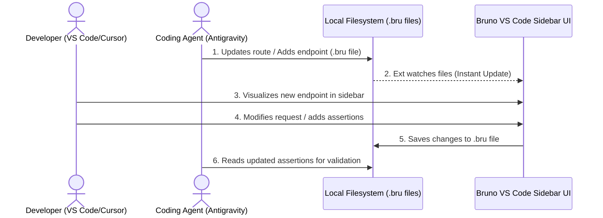

# VS Code & Cursor Extension Integration Guide

Unlike legacy API clients (e.g. Postman, Insomnia) that store API collections in cloud databases or complex proprietary binaries, **Bruno** is designed around a simple concept: **API collections are just standard folders and text files in your repository**.

Because of this file-based architecture, coding agents (like Antigravity) and human developers using IDEs like **VS Code** or **Cursor** can collaborate in real-time on the same API files without needing synchronization servers.

---

## The Shared-State Workflow

Here is how the collaboration workflow functions:

---

## 1. Setup in VS Code / Cursor

To interact visually with your Bruno collections:

1.  Open the Extensions marketplace in your editor (`Ctrl+Shift+X` or `Cmd+Shift+X`).
2.  Search for **Bruno** (by `usebruno`) and click **Install**.
3.  Once installed, you will see a Bruno icon in the VS Code Activity Bar (sidebar).
4.  Click the Bruno icon, then click **Open Collection**.
5.  Select the folder configured as your destination (e.g. the `bruno` directory at your project root).

Now, the entire API structure is visualized beautifully as a tree in your editor!

---

## 2. Instant Collaboration Rules

Because the state is purely file-based, here is how you and the AI coding agent work together:

### Agent-to-Developer Sync
*   When the agent develops a new API route in the backend code, it runs `python3 scripts/sync_bruno.py sync`.
*   The script adds a new `.bru` file to the collection.
*   Your VS Code Bruno sidebar will **instantly render the new request** without reloading.
*   You can click on the request, click "Send", and test the endpoint immediately.

### Developer-to-Agent Sync
*   If you manually edit a request (e.g. adding authentication details, request body parameters, headers, or javascript tests), the extension writes these changes directly into the `.bru` file.
*   When the agent reads the `.bru` file later, it will **detect all your custom updates**.
*   The sync tool has a smart merging algorithm that parses and preserves your custom edits (headers, body parameters, tests) and only updates the base routing URL/method when code changes.

---

## 3. Version Control Advantages
Since all collections are inside the repository:
*   **Git Diff**: Review API changes during standard Pull Request reviews just like code.
*   **Merge Conflict Resolution**: Use VS Code's standard Git merge editor to resolve differences in API endpoints. No more corrupted workspace files!
*   **Single Source of Truth**: The API collection is always in sync with the branch you are currently working on.